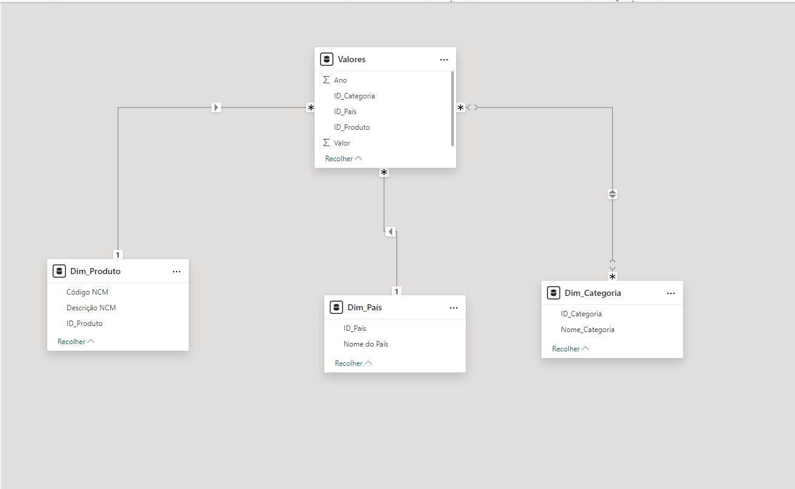
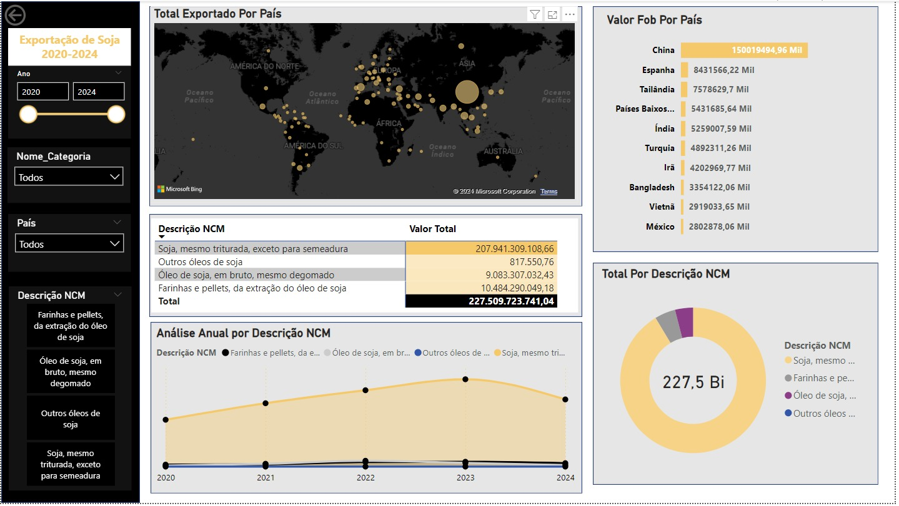

Objetivo do Projeto

Analisar as exportações brasileiras de soja (2020–2024) considerando:
- Farinhas e pellets do óleo de soja
- Óleo de soja em bruto
- Outros óleos de soja
- Soja triturada (exceto para semeadura)

As métricas avaliadas:
- Valor FOB (R$) – valor financeiro exportado
- Quilograma Líquido (milhões de toneladas)
- Quantidade Estatística (milhões de toneladas)

Dados coletados em 12/11/2024 via ComexStat.

Coleta e Fonte dos Dados

- Fonte: Plataforma [ComexStat](https://comexstat.mdic.gov.br/)
- Período: 2020 a 2024
- Formato: Arquivos CSV tratados em Excel

Tratamento dos Dados

Etapas executadas:
- Limpeza e padronização de colunas
- Remoção de dados nulos e colunas irrelevantes (ex: "Unidade Estatística")
- Padronização de nomes e tipos (ex: “País” → ID_Pais)

Modelagem aplicada:
- Separação entre tabelas dimensão (País, Produto, Categoria)
- Construção da tabela fato com as colunas:

SQL: Criação de Dimensões

As dimensões foram criadas para organizar os dados de forma relacional. Cada dimensão foi projetada com um propósito específico:

1. Dim_País: Criada a partir da coluna de países, com atribuição de IDs únicos.
2. Dim_Produto: Criada a partir dos códigos e descrições NCM, com IDs únicos.
3. Dim_Categoria: Criada para associar IDs às categorias (Valor FOB, Quilograma Líquido e Quantidade Estatística).

🧠 Modelagem Dimensional no Power Bi

Criação do Dashboard

No Power BI, os seguintes elementos foram criados para análise dos resultados de cada descrição NCM de acordo com as categorias:
- Filtros: Para seleção dinâmica de dados.
- Cartões: Para exibição de métricas resumidas.
- Gráficos: Representação visual de tendências e comparações.
- Tabelas: Detalhamento das métricas por categoria e país.
- Mapas: Visualização geográfica dos principais destinos de exportação.

Dashboard de Exportações de Soja (2020–2024)

📊 Resultados Obtidos

 Farinhas e Pellets (Extração do Óleo de Soja)

  Valor FOB
- Total: R$ 10,48 bilhões  
- 📈 Crescimento em 2021 (17,55%), 2022 (96,86%), 2023 (5,48%)  
- 📉 Queda em 2024 (-28,65%)  
- 🌍 Principais destinos: Indonésia, Polônia, Tailândia

 Quantidade Estatística
- Total: 22,06 milhões de toneladas  
- 📈 Aumento até 2023, queda de -17,05% em 2024  
- 🌍 Destinos: Indonésia, Polônia, Tailândia

  Quilograma Líquido
- Total: 22.057,12 milhões kg  
- 📈 Crescimento até 2023, queda de -17,21% em 2024  
- 🌍 Destinos: Indonésia, Polônia, Tailândia

Óleo de Soja em Bruto (Mesmo Degomado)

Valor FOB
- Total: R$ 9,08 bilhões  
- 📈 Crescimento até 2022, 📉 quedas acentuadas em 2023 (-36,9%) e 2024 (-57,7%)  
- 🌍 Destinos: Índia, China, Bangladesh

Quantidade Estatística
- Total: 7,99 milhões de toneladas  
- 📈 Alta em 2021–2022, 📉 queda de 50,47% em 2024  
- 🌍 Destinos: Índia, China, Bangladesh

Quilograma Líquido
- Total: 7.957,44 milhões kg  
- 📉 Mesmo comportamento: queda brusca a partir de 2023  
- 🌍 Destinos: Índia, China, Bangladesh

 Outros Óleos de Soja

Valor FOB
- Total: R$ 817 mil  
- Oscilação severa: 📉 queda em 2021, 📈 alta até 2023, 📉 forte queda em 2024  
- 🌍 Destinos: Paraguai, Venezuela, Nicarágua

 Quantidade Estatística
- Total:0,08 toneladas  
- Queda de 100% em 2022  
- 🌍 Destinos: Portugal, Bélgica, Paraguai

 Quilograma Líquido
- Total:0,68 toneladas  
- Altamente instável, com crescimento pontual em 2023  
- 🌍 Destinos: Paraguai, Venezuela, Portugal

🟢 Soja Triturada (Exceto para Semeadura)

 Valor FOB
- Total: R$ 207,94 bilhões  
- 📈 Crescimento consistente até 2023, 📉 queda de -23,08% em 2024  
- 🌍 Destinos: China, Espanha, Tailândia

 Quantidade Estatística
- Total: 447,52 milhões de toneladas  
- Variações suaves, queda de -7,53% em 2024  
- 🌍 Destinos: China, Espanha, Tailândia

 Quilograma Líquido
- Total: 443.909,15 toneladas  
- Trajetória semelhante à estatística  
- 🌍 Destinos: China, Espanha, Tailândia

Conclusões

 Tendências de Valor FOB
- Óleo de soja: boom até 2022, queda brusca depois  
- Farinhas: crescimento estável  
- Outros óleos: comportamento errático  
- Soja triturada: crescimento contínuo até 2023, depois desaceleração

 Comparativo de Volumes
- Quilograma Líquido e Quantidade Estatística seguem padrões parecidos
- Crescimentos moderados até 2023 com quedas em 2024

🌎 Principais Destinos
- Soja: China, Espanha, Tailândia  
- Farinhas: Indonésia, Polônia, Tailândia  
- Óleo Bruto: Índia, China, Bangladesh  
- Outros Óleos: Paraguai, Venezuela

🚀 Melhorias Futuras

- ➕ Incluir outras commodities (milho, carne bovina)  
- 📅 Criar análises mensais/trimestrais  
- 🤖 Automatizar o ETL com Python, Power Query ou SQL  
- 🌐 Publicar dashboards no Power BI Service

